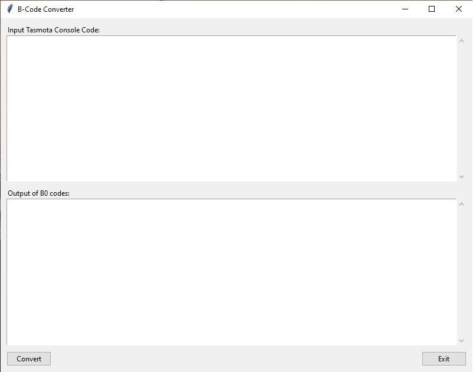
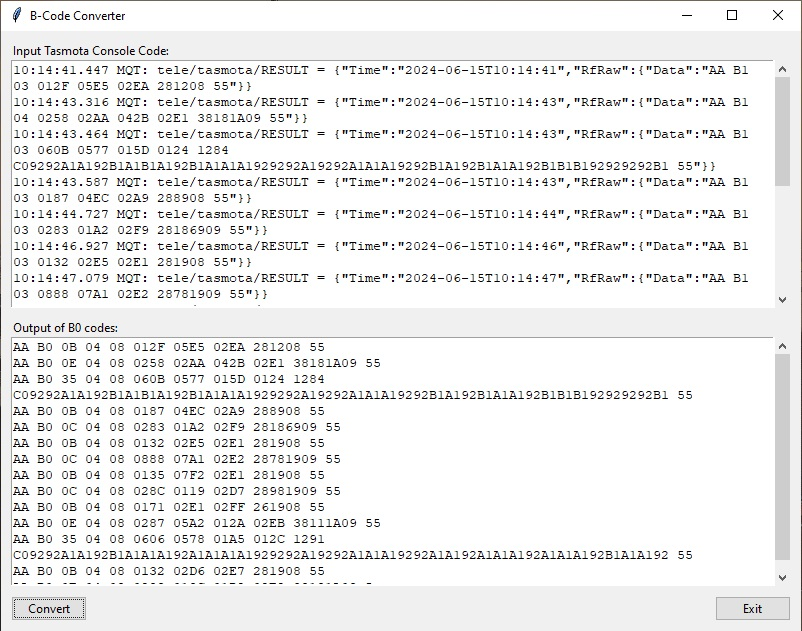

# B1-code converter for Tasmota/Portisch
For devices that run Tasmota and Portisch firmware to convert the received B1 code into B0. Tested with Tasmota 14.4.1 and Portisch 0.4.9 with a Sonoff RF Bridge R2 V2.2 and Yooda 433MHz remote controls for shutters and B1 codes found on different sites.

## motivation
There exists an online tool for it you can use: https://bbconv.hrbl.pl/
The website is down from time to time and the provided Python file in the [Portisch Wiki](https://github.com/Portisch/RF-Bridge-EFM8BB1/wiki/Decode-0xB1-sniffed-data) doesn't seemed to work and has a lot of functionality besides code conversion. The python code includes a simple GUI and a standalone version for Linux, Windows 10 & 11 can be found in the installer folder.

## conversion
Information for B1 and B0 code can be found in the Portisch Wiki, but for the conversion I mainly looked at available B1/0 codes that I received from my devices and online converter. Comments on my thought process can be found in the python file.
It is tested on a very limited sample size. When you find that the online tool can convert a code this can't, please let me know.

## usage
Copy the Tasmota console output from the Portisch command 'rfraw 177' into the input text box and hit convert button on the bottom left.

# resources
- https://github.com/Portisch/RF-Bridge-EFM8BB1/wiki/
- https://tasmota.github.io/docs/
